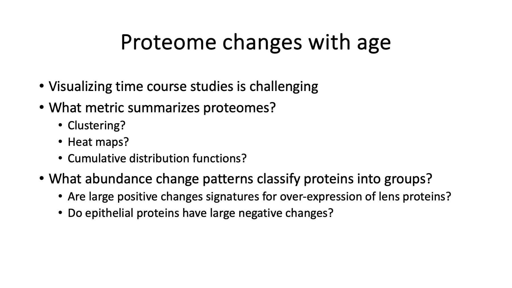

# mouse_lens_development_Khan2018_reanalysis

## Data from PRIDE: [PXD006381](https://www.ebi.ac.uk/pride/archive/projects/PXD006381)

## Publication from IOVS: [Khan et al. 2018](https://iovs.arvojournals.org/article.aspx?articleid=2670138)

### Re-analysis by Dr. Phillip Wilmarth Proteomics Shared Resource Oregon Health & Science University Late 2023 and early 2024

---

## Overview

This README file describes the re-analysis of a large mouse lens development study using quantitative bottom-up proteomics methods (fractionated 10-plex TMT labeling). The description is in a presentation style with slide images followed by detailed descriptions.

---

## Presentation (40 slides)

*Slide 1*

Mouse lenses are used in a variety of vision research studies and the development of the young mouse lens is an important reference system. In 2018, [Kahn et al.](https://iovs.arvojournals.org/article.aspx?articleid=2670138) published a deep proteome profiling of the developing mouse lens. The data is publicly available from the Proteomics Identification Database (PRIDE) with project number [PXD006381](https://www.ebi.ac.uk/pride/archive/projects/PXD006381). A thorough re-analysis of the data is presented here as a resource for the lens research community.

> Khan, S.Y., Ali, M., Kabir, F., Renuse, S., Na, C.H., Talbot, C.C., Hackett, S.F. and Riazuddin, S.A., 2018. Proteome profiling of developing murine lens through mass spectrometry. Investigative Ophthalmology & Visual Science, 59(1), pp.100-107.

---

*Slide 2*

Mice lens from 6 development ages (2 embryonic and 4 postnatal) were dissected, homogenized, digested with trypsin, labeled with [tandem mass tag](https://pubs.acs.org/doi/abs/10.1021/ac0262560) reagents (TMT 10-plex), labeled peptide digests extensively fractionated, and analyzed with liquid chromatography mass spectrometry (LC-MS). The 6 ages are in the first 6 channels (by tag m/z); the other 4 channels are either unspecified samples or unused. Each plex (one TMT experiment) was separated into 24 fractions (LC runs) for deep proteome profiling. The mass spectrometer was a Thermo Lumos Tribrid and data collected using the more accurate SPS-MS3 data acquisition method (although in an unusual mode where the MS2 scan was taken in the Orbitrap rather than the linear ion trap).

Several mouse lenses were pooled at each age to get sufficient protein and the set of ages was repeated in 3 separate TMT experiments. The ages and number of mice per pool are listed in the table below:

Age|Age label|Number of mice|Number of replicates
---|---|---|---
Embryonic day 15|E15|23|3
Embryonic day 18|E18|10|3
Newborn|P0|8|3
3-day old|P3|8|3
6-day old|P6|8|3
9-day old|P9|8|3

The ages span important early development times and the ages are mostly 3-days apart. The mouse strain is not stated in the above reference. An earlier transcript study suggests that the mice are C57BL/6 strain from Charles River. The gestation period for C57BL/6 mice is 19 days from a web search. The gestational period was not stated in the paper (the E18 and P0 ages are probably 1 to 1.5 days apart).

I do not know what to call repeated pools of different biological subjects. They are not true biological replicates because the pooling is a form of averaging. Variance is likely lower for a set of pooled samples compared to the same number of individual samples; however, inbred mouse stains have low biological variance by design. They are not strictly technical replicates either as sample collection and processing was done independently.

---

*Slide 3*

The publicly available data (72 RAW files; 3x24) was downloaded from PRIDE and processed with the [PAW pipeline](https://github.com/pwilmart/PAW_pipeline). The [Comet search engine](https://uwpr.github.io/Comet/) was used to assign peptide sequences to MS2 spectra. The protein sequence collection was a UniProt canonical mouse FASTA file (21,957 sequences; downloaded June 2023) with 175 common contaminants and concatenated reversed-sequence decoys. Precursor tolerance was 1.25 Da (monoisotopic), fragment ion tolerance was 0.02 Da (monoisotopic), semi-tryptic cleavages were specified with up 2 missed cleavages, variable oxidation of methionine was allowed, and static modifications were used for alkylation of cysteine and TMT reagents (10-plex 229.1629 Da) on peptide N-terminus and lysines.

The PAW pipeline takes an interactive approach to control peptide-spectrum match (PSM) errors. Peptides are restricted to 2+, 3+, and 4+ charge states and a minimum peptide length of 7 is required. First, delta mass histograms for each charge state are examined to set two narrow windows: one on the 0-Da peak of unmodified peptides, and a wider window to capture the 0.984 Da deamidated peptide peak and the 1.008 Da first isotopic peak mis-called monoisotopic peaks. All other delta masses outside the two windows are also considered. Next, overlaid target and decoy score histograms are conditioned on the three delta mass regions for each charge state. Scores are separated by semi or fully tryptic status. Scores are additionally separated for unmodified peptides and variably modified peptides. Score cutoffs are set at the desired false discovery rate (FDR is typically 1%) in each PSM subclass to achieve an experiment-wide FDR.

The set of confident PSMs are written to new filtered files. The peptide sequences associated with the confident PSMs are mapped to protein sequences in the FASTA file and proteins inferred using basic parsimony logic. The protein ID requirement was 2 distinct peptides per protein per plex. The set of confident inferred proteins were further tested for sufficient unique evidence to allow quantification of individual proteins or protein groups (indistinguishable proteins). Proteins with overwhelming common peptides are grouped together (extended parsimony logic) for quantification of protein families instead of individual proteins or protein groups. The resulting set of proteins, protein groups, or protein families are the final set of proteins for determining if peptides are usable for quantification (unique peptides) or excluded from quantification (shared peptides).

During RAW file processing, the reporter ion peak heights from MS3 scans are extracted for each MS2 scan. For each final protein, protein group, or protein family, for each unique peptide, for all associated MS2 scans, the MS3 scan reporter ion peak heights are summed into a total protein intensity for each TMT channel.

The experiment has each set of replicates (ages) done in separate TMT experiments (plexes). The protein total intensities from each TMT plex need to be combined into a final results table. This is not straightforward in TMT experiment because of how the instrument samples eluting peptides (acquires MS2/MS3 scans). A better way to design multiple plex TMT experiments involves using common reference channels in each plex in a technique called [internal reference scaling (IRS)](https://pwilmart.github.io/TMT_analysis_examples/IRS_validation.html). This experiment lacked reference channels but it did have a balanced study design where all ages were included in each plex. The plex-wide average intensity can be used as a mock reference channel for each plex. The IRS method was  applied using the mock reference channels to create a final data table for the 18 samples (6 ages with 3 replicates each).  

---

*Slide 4*

Across the 3 plexes, almost 1.5 million MS2/MS3 scans were acquired. The ID rate was okay (almost 19%) and 278K scans passed the FDR filtering. The first set ran the best producing the highest numbers of filtered PSMs and inferred proteins. The second set showed a drop in number of confident PSMs, although the total reporter ion intensity was similar to set 1. The third set showed some significant drops in IDs and intensities. The mass calibrations and resolutions were very good.

---

*Slide 5*

 The PAW pipeline outperformed the original analysis that used Proteome Discoverer. Some search parameters were not optimal in the original analysis like the mouse Swiss-Prot database choice (17K sequences is a little incomplete) and the 10 PPM precursor mass tolerance (narrow tolerance searches render accurate masses useless in distinguishing correct and incorrect PSMs). Most commercial and non-commercial proteomics data analyses software packages perform poorly and/or have conceptually flawed default parameter settings. The poor performance is already apparent for basic peptide and protein identifications. Quantification is more complicated than identification and I have not seen any reliable quantitative results from any other software I have used in my 20+ years doing proteomics data analysis. I spend considerable time and effort coding my pipeline because there were (and still are not) any other usable choices for quantitative TMT experiments.

 ---

 *Slide 6*

 

 We have data (protein intensities) from each TMT plex and we need to get it into a single summary table before we can do anything with the data. Each plex contains a full set of ages and each plex is one set of age replicates. [Internal reference scaling (IRS)](https://www.sciencedirect.com/science/article/pii/S1535947620323938) is the most rigorous way to combine multiple TMT plexes. It was developed in 2017 and has been cited in over 250 publications to date. IRS is not just a data adjustment method (a special type of normalization), it is also an experimental design description. The IRS design uses duplicate channels of a pooled peptide digest internal standard in each plex to compute individual protein intensity scaling factors to put all plexes on a common intensity scale. See https://pwilmart.github.io/TMT_analysis_examples/IRS_validation.html for more details.

 This study did not have any reference channels; however, the allocations of samples per plex was very balanced. The balanced study design lets us compute a "mock" reference channel vector for each plex by taking the average intensity for each protein over the 6 ages. The mock reference channels can be used in the IRS method instead of actual reference channels.

 An inferior way to combine data from multiple plexes that is commonly done involves taking intensity ratios to "something" present in each plex. The common something (often called a bridge channel) can be a pooled reference channel or a sample repeated in each plex. There are serious downsides to this approach. Since it takes two channels to make one ratio, you end up with fewer columns of ratios than number of samples. Ratios are a unit-less self-normalized numerical scale (like percentages) that have compressed dynamic range and are asymmetric. Half of the values are typically between 0.0 and 1.0 and the other half are greater than 1.0. This asymmetry is usually addressed by taking logarithms, which causes further dynamic range compression. Ratios and log ratios are not intuitive measurement spaces making quality control difficult.

 The natural protein intensity scale provides relative protein abundance for the proteome under study. It can be very important in interpreting data to know which proteins are highly abundant and which proteins are barely detected. That information is lost when ratios are used.

 Relative protein abundances can also be very important in statistical modeling. These types of measurements exhibit trended dispersion that can be incorporated into the statistical modeling. High abundance proteins typically have lower variance compared to low abundance proteins, which can have much larger variances. This behavior is partly due to the constrained nature of the samples (cells have finite volumes) and experimental designs (equal amounts of each sample are processed). High abundance protein lack the freedom to have large abundance differences compared to lower abundance proteins. Lower abundance protein measurements may also be noisier and have more measurement variability.

 ---

 *Slide 7*

 

 IRS is not a general purpose normalization algorithm. TMT experiments have a very specific distortion of the measurements related to the way the mass spec instrument samples analytes. IRS is a very specific data adjustment that addresses just this instrument distortion. It removes the pseudo random instrument sampling of eluting peptide ions. It bears repeating: **IRS is not a general-purpose normalization technique.** IRS is more like a batch-correction method.

 The digestion, labeling, and mixing steps are all designed to have equal amounts of each sample. Protein assays are done on samples before digestion so that the same total amount of protein is digested. Peptide assays may be done after digestion to verify that there are equal amounts of peptides from each sample being labeled. Different volumes of samples are used in these bench steps to "normalize" between samples. I call these sample adjustments "bench normalizations" and they are part of all quantitative proteomics experiments.

 The sum of the reporter ion intensities in each channel is a proxy for the total amount of protein in each sample. After we mix the samples (the multiplexing) and generate the mass spec measurements, we should theoretically have equal total intensities per channel within each plex. That never seems to be the case in practice. That is why there is a grand total intensity matching normalization that is done before any other normalizations. The SL-normalization (sample loading) just makes the data more accurately reflect the bench steps. The SL-normalization factors are global (one factor per channel) scaling factors that are the same for all proteins in the respective channel (sample). Software normalizations like this are also part of all quantitative proteomics experiments and are done in addition to the bench normalizations.

 When there are multiple plexes, the global intensity scales between plexes may be quite different. IRS does adjustments at the protein level. If there are 5,000 proteins in the results table, there will be an equal number of IRS adjustment factors for each plex (3 sets of 5,000 IRS factors here). The IRS factors (computed from the reference channels) for each protein are used to adjust all the biological samples (channels) for that protein in each plex. The relative intensity differences between biological samples within each plex are preserved. After IRS, the intensities for each protein in each plex are adjusted to a common intensity scale. The 3 plexes with 6 channels each become effectively one plex with 18 channels. In a proper IRS experimental design, common pooled channels present in each plex are used to compute the adjustment factors so that the biological sample data remain mathematically independent from the adjustment data. Here, where we used the plex-average intensities as mock reference channels, there is some dependence between the IRS factors and the final data values.

 ---

 *Slide 8*

 

We can check a few things to see exactly what effect IRS has on the TMT data. We expect our mock reference channels to be very similar between the 3 plexes because they are from highly similar mice, many lenses were pooled at each age, and we are averaging over 6 ages. We can make scatter plots of the three plex averages to each other before IRS (on the left) and after IRS (on the right). The scatter plots on the left show how much the pseudo random sampling introduces high variance into multi-plex TMT experiments. These three samples should be nearly identical. The IRS algorithm mathematically forces the reference channels (the plex averages here) to be identical, hence the perfect scatter plots on the right. The box plots in the center are before IRS for the first 3 and are after IRS for the 3 on the right.

---

*Slide 9*

IRS dramatically reduces the variance between replicates at each age. A great metric for seeing what effect normalization has on variance are distributions of the coefficients of variance (CVs) for each biological group. The average median CVs drop from 54% to less than 14%, about a 4-fold improvement. This has profound effects on statistical testing.

---

*Slide 10*

Another good data visualization for seeing before and after IRS effects are scatter plot grids of samples (mice ages here) within biological groups. Three ages (E18, P0, and P6) are shown. The top grids are sample intensities before IRS. The bottom grids are sample intensities after IRS. There is dramatically reduced scatter (variance) after IRS.

---

*Slide 11*

IRS resembles batch corrections and one of the best ways to spot batch effects are PCA (principal component analysis) or MDS (multi-dimensional scaling) plots. The left MDS plot has coloring by TMT plex and is the data before IRS. Each plex forms a tight cluster indicating a strong TMT-plex-batch-like effect. The center MDS plot is after IRS and the samples are colored by age. The ages separate along the x-axis. The right MDS plot is after running TMM normalization (discussed in Slide 20) on the IRS adjusted data. Samples are colored by age and separate along the x-axis.

---  

*Slide 12*

Perhaps the most common way to check normalizations are box plots of data distributions. The plots here are log10 intensity value distributions. The coloring is by age (dark red is E15, P9 is brighter green, etc.). The starting data on the left shows the reduced intensity of the third TMT set. The third box plot for each color has a lower median (the notch) and wider interquartile range (IQR, the top-to-bottom height of the colored box). There is also a sag in the medians and IQR with increasing age, although that trend is harder to see in this starting data.

The center plot is after IRS. Within each age, the medians and IRQ are horizontally in alignment. The notches and boxes step down in intensities with increasing age. The dark red (E15) samples have higher notches and boxes than the brighter green (P9) samples. The open circle points above the top whiskers are the highly abundant lens proteins like the crystallins. These highly abundant proteins increase in intensity with increasing age and they push down the rest of the distributions.

This increased expression of crystallins with age is exactly the kind of situation that TMM normalization was designed to address (discussed in Slide 20). The box plots on the right are after running TMM on the IRS adjusted data. The median intensities and IQRs are in much better horizontal alignment. The upper whiskers are also now in alignment. The open circle proteins show a steady increase with increasing age.

---

*Slide 13*

The previous few slides were some of the quality control checks and data visualizations that we can do before any statistical testing. It is important to check that the collected data looks okay for all samples. There are many things that can (and do) go wrong in these experiments. The QC steps also give us insight into the data and inform what statistical testing to try.

Data normalization assumptions (what data aspect to make more similar) and the null hypothesis (what is similar) in statistical modeling are intimately coupled. Normalization assumptions and statistical modeling assumptions need to be in agreement. There are many normalization methods that have been developed for a wide variety of data; only a few of them are appropriate for these quantitative proteomics experiments.

---

*Slide 14*

There is a lot that is known about mouse lenses and aging changes. I suspect many readers of this writeup will know far more than me about mouse lenses. A recommended paper is [Ueda et al., 2002](https://iovs.arvojournals.org/article.aspx?articleid=2123357) from back in the day when 2D-PAGE and proteomics were almost synonymous. Seeing only lens crystallins in 2D-PAGE studies is no accident. There are a lot of crystallin proteins in lenses and 2D-PAGE has maybe a 1:20 to 1:50 dynamic range with visible staining. Crystallins and some other major lens proteins have been extensively studied. They give us some known developmental expression patterns and provide some sanity checks.

Newer proteomics methods such as TMT labeling used in this study have dramatically improved quantitative performance. The number of samples that can be done in a study is dramatically larger than previous methods. TMT labeling is compatible with deep fractionation and allows deep proteome profiling. It is hard to study the non-major lens proteins in lens due to the over-expression of the crystallins and a handful of other proteins. Our knowledge of lens biology may be too simple and limited by prior studies not being able to characterize much beyond the crystallins.

There are some lens facts necessary for interpreting this study. The lens has little protein turnover. The center of the lens has the oldest proteins (prenatal) and layer after layer of newer fiber cells are added with age. Mature fiber cells lack organelles and enzymatic activity. The fiber cell plasma membrane contains specialized lens-specific membrane proteins that compliment the unique crystallins. The central part of the lens is called the lens nucleus (not to be confused with a cell nucleus) and it is surrounded by differentiating fiber cells called the lens cortex. The cortical region spans newly differentiating epithelial cells on the outer layers in a gradient towards mature fiber cells in the region between the cortex and the nucleus. The anterior face of the lens is made up of a monolayer of dividing cubic epithelial cells. When epithelial cells get pushed to the equator (the anterior to posterior axis of the lens define the poles), they encounter chemical signals to start differentiating into mature fiber cells.

When a whole lens is homogenized and protein extracted from the cells, the protein will be a mixture of epithelial cell proteins, cortical cell proteins, and mature fiber cell proteins. The fraction of protein from each of these three cell populations to the total will depend on the age of the lens (the relative size of the lens as these are geometric factors).   

---

*Slide 15*                                                       

The lens grows from conception until death (although not at constant rates). Rates of lens growth slow with older ages. There are geometric factors affecting total lens protein composition. The surface area of spheres grows as R squared. The volumes of spheres grow as R cubed. Larger lens will have relatively more mature fiber cells (interior volume) compared to epithelial cells (half the surface area), for example.

Because of lens growth and the composition of mature fiber cells, we can make some predictions of expression patterns with age. Proteins that originate from epithelial cells will be diluted with increasing age as more crystallins accumulate in the growing lens nucleus. The fraction of the total protein that comes from major lens proteins (crystallins, intermediate filaments, aquaporins, connexins, etc.) will increase. In fact, the total amount of these lens proteins increase with age as the lens continues to grow. The cortex contribution is more complicated to predict. These cells are not homogeneous. The outer cortex cells will be closer to epithelial cells in composition while the inner cortex cells will resemble mature fiber cells. Also, since mature fiber cells accumulate with age and major lens protein expression changes with age, the composition of mature fiber cells is not really homogeneous either.

The whole lens protein extracts at each age are the bulk average over all these cell types and numbers and over all ages from conception up to the time of lens collection. Proteins from mice lenses at different ages are **not snapshots of protein expression at that age** like transcriptomics would be.

---

*Slide 16*

It is not too hard to calculate how sphere surface area and volume change as a function of sphere diameter to better understand how lens growth alter proteome composition. The figure shows the cross section of two spheres. The inner light blue sphere has half the volume as the outer dark blue sphere. The diameter only increases by 1.26 yet the sphere volume doubles. The surface area is 1.6 times larger.

---

*Slide 17*

In light of the geometric factors from a growing lens and the compositional differences of epithelial, cortex, and mature fiber cells, data normalization will be critical to understanding changes in mouse lens with age.

Data normalization is not a "one size fits all" situation. In fact, there are multiple normalizations performed in these experiments to address and minimize specific sources of variation "as you go". During method development, sample collection and processing steps may be evaluated and optimized before the actual experiment is performed. There are multiple protein and peptide assays done to make sure that the total amount from each sample is the same for the labeling reactions. The total reporter ion signals from each channel (sample) are often checked and adjusted to be more similar. Ion currents measured by the mass spec instrument degrade with use and frequent standards are run to determine when to maintain the instrument to restore ion current levels (calibrations, cleaning of optics, HPLC washes, etc.). These physical adjustments are designed to make the samples more similar and make the measured signals more constant. In other words, they are normalizations.

There are also numerous data normalization software algorithms that can be applied to the data after it is collected. A major logic flaw is thinking that any normalization algorithm can be applied to any dataset. Normalization are not "mix and match". Every normalization method has a specific mathematical property of the data that it tries to make more similar between samples. These mathematical properties have to be translated into biological language to see what biological property is being made more similar between samples. The biological property being made more similar has to be consistent with a given experimental design and the biological question of interest. Most normalization methods will turn out to be incompatible with the biological experiment. The disconnect between defining the biological question, the experimental design, the proteomics technique, the data normalizations, the statistical modeling, and the results interpretation guarantees **no experiment will ever be analyzed 100% correctly.**

---

*Slide 18*

Another serious misconception in these experiments is that only one software normalization step is needed. Multi-plex, fractionated TMT experiments will require many LC runs and many hours of instrument use. Instrument (LC and mass spec) performance will wax and wane over the course of the experiment as system suitability is monitored and addressed (tuning, calibrating, cleaning, etc.). Some coarse data adjustments may be needed before specific data adjustments like IRS are applied. TMT data after IRS has the same data characteristics as any single-plex TMT data set. Any biological normalizations (matching grand totals, matching medians, TMM, etc.) that would be used on single plex TMT data should be applied to IRS-adjusted TMT data, too. Multi-plex TMT experiments typically require three software data normalization steps.

---

*Slide 19*

 Biological normalization and the null hypothesis in a statistical test are related concepts. Normalizations make something about the data more similar (not changing). A common assumption in many experiments is that the bulk of the proteins are not changing in abundance. Good data normalization (under this assumption0) would minimize the abundance differences for the bulk of the proteins. This should sound a lot like hypothesis testing where most proteins fall into the null hypothesis category (unchanged abundances between conditions) and the probability that some proteins are not likely (small p-values) to fall into the null category are the proteins of interest. The probabilities for rejecting protein abundance differences between conditions will directly reflect how similar or different the bulk of the proteins are between conditions after normalization. Different normalization algorithms will result in different data values and different statistical modeling p-values. These differences can be enormous.  

 > Depending on the type of modeling, batch corrections and other kinds of normalization issues can be explicit terms in the modeling. These corrections cal also be done to the data before modeling. There are arguments for and against either approach.

 ---

 *Slide 20*

 

Matched intensity totals between samples is one way to normalize the data in TMT experiments (the same total amount of protein per sample is labeled), but may not be an appropriate normalization of the data. The constrained nature of the experimental designs leaves the data vulnerable to distortions if highly abundant proteins change in abundance. Highly abundant proteins contribute more to the signal total and the constrained total limits how much abundant proteins can differ. If the high abundance proteins increase in abundance, all other proteins have to decrease in abundance to have the same total.

Not all systems under study fall into this category, but over-expression of crystallins in lenses most likely does. The box plots are the distributions of the average intensities per age (average of the 3 replicates) using two normalization methods. On the left, we have matched the grand total intensities per age. We see that the medians (notches) and IQRs (the colored boxes) decrease with increasing age. The bulk of the proteins are pushed down in relative abundance by the increased abundance of the open-circle proteins above the top whiskers (the major lens proteins). This is the way constrained systems behave - if something goes up something else has to go down.

The [Trimmed Mean of M-values (TMM)](https://link.springer.com/content/pdf/10.1186/gb-2010-11-3-r25.pdf) normalization method was developed for these constrained experimental designs. By excluding high abundance proteins, low abundance proteins, and proteins with large fold-changes, the remaining proteins better meet the assumption of the bulk of the proteins not having abundance differences. The TMM algorithm minimizes the differences between samples using the trimmed subset of proteins. A single global scaling factor is computer for each sample. The box plots on the right are the data after TMM normalization. The median intensities and IQRs are horizontally aligned by boosting the intensities of the bulk of the proteins for the older ages. This pushes up (even more) the high abundance protein intensities progressively with increasing age.

 > Ratio based data transformations are not compatible with the TMM algorithm.

 ---

 *Slide 21*

 The two normalization choices result in dramatically different statistical testing results. One-way ANOVA tests if all 6 ages have similar intensities. Small p-values mean that one or more of the ages differed from the rest of the ages. We do not know which age(s) were different until we examine the data for each protein. Because we have some prior knowledge of mouse lens development, we expect proteins to go up with age, down with age, or (maybe) stay more similar. We can take the two earliest ages (E15 and E18) and compare those to the two older ages (P6 and P9) using an easier to understand par-wise testing.

 There are many more DE candidates when we match the total intensities per sample (IRS without TMM) and we have many more decreasing protein abundances than increasing. On the other hand, TMM aligns the intensities of the bulk of the proteins and this balances out up or down abundance differences and dramatically reduces the number of statistically significant changes. The major lens proteins are all in the up direction, but their small number does not throw off the counting.

 ---

 *Slide 22*

 We can explore the characteristics of the DE candidates that we get when using intensity grand total matching between samples. The box plots are colored to show the 6 early ages (in blue) that are compared to the later ages (in green).

 The MA plot on the right shows log2 fold changes (y-axis) as a function of average total protein intensity (the x-axis). Proteins that increased in abundance with age are highlighted in red. Proteins that decreased in abundance with age are highlighted in blue. The black dots are the proteins that were not significantly different. The solid black horizontal lines are the 2-fold levels.

 The red points are biased towards high abundance and the blue points cover a wide range of abundances except for the highest abundances. We have many candidates in both direction that have more than 2-fold changes. There are also many significant proteins that have rather small fold-changes. I am not sure what to do with 3,400 blue candidates, but the 152 up candidates might be a pretty good way to identify the mature fiber cell lens proteins.

 ---

 *Slide 23*

 These are the same plots for the data after TMM normalization. Not surprisingly, we have balanced numbers of up and down DE candidates. There are also many more non-significant proteins. The numbers of candidates above or below the 2-fold lines are smaller (in total - more red points but far fewer blue points). There are still large numbers of statistically significant proteins with less than 2-fold changes. It is unlikely that mature fiber cells have over a thousand proteins, so a fold-change cutoff in addition to a statistical significance cutoff would probably be needed.

 ---

 *Slide 24*

 Other data visualizations can be used to contrast the two normalization methods, such as distributions of log2 fold change color coded and faceted by statistical significance cuts (purple > 0.10 > teal > 0.05 > olive > 0.01 > orange). It is clear that TMM better centers the data for the bulk of the proteins.

 ---

 *Slide 25*

 We can also do faceted MA plots by significance cuts. Hopefully, the interplay between data normalization and statistical testing significance is now more apparent.       

We have a catch-22. Did the highly abundant proteins stay the same in abundance and the majority of the proteins go down in abundance? Or did the majority of the proteins stay the same abundance and the highly abundant proteins increased in abundance? Which normalization method and statistical testing results are the "correct" ones?

I am not sure there is a simple answer here. Either normalization seems justifiable and the statistical testing results are consistent with how the normalization adjusted the data. The choice probably depends on what proteins are of most interest. The lens is dominated by over-expression of crystallins. If the behavior of the crystallins are of interest, maybe grand total intensity matching makes it easier to interpret the results.

Maybe lower abundance proteins play important roles in developmental processes in the cortex and would be associated with the bulk of the proteins. TMM normalization seems more sensible for the majority of the proteins (more unchanged proteins, more balance between up and down expression changes, etc.). More important than which normalization is "best" (if that is even a valid question), is understanding how normalization and statistical testing are coupled so that erroneous interpretation of results can be avoided.

---

*Slide 26*

Now that we have addressed some of the messy data details that influence the results we will get, we can start thinking about how to interpret the results. There are 6 ages, so time course patterns of protein expression will be of interest. Visualizing time course data is very challenging. With 6 time points, there are many possible patterns (steady up, steady down, flat, flat then up, flat then down, down the flat, up then flat, rise and fall, fall and rise, etc.). These time patterns will depend on the normalization choice similar to how statistical modeling was affected. Small relative differences between ages and/or noisy data can make patterns hard to see. Clustering proteins by similar patterns sounds possible, but that is a difficult problem to code.

Are there ways to simplify categorizing protein abundance changes given what we know about mouse lens development? One-way ANOVA tests if protein abundances across the ages are unlikely to have been the same (remember hypothesis testing is like asking backwards questions). Proteins with very small p-values mean one or more of the ages had very different abundances than the rest of the ages. Proteins that do not have very small p-values are likely similar abundances across the ages. As we have already seen, normalization choice has a big effect on numbers of statistically significant proteins. Since ANOVA does not tell us which age was different nor how it was different (up or down), we need additional information to sort out things.

We know that the lens will grow over these ages and that older ages will have much more crystallin and other lens proteins. We know how over-expression of a small number of highly abundant proteins alters the proteomes. We assume/know that there will be large differences between the youngest ages and the oldest ages. We could compare E15 to P9, for example. With 3 replicates, we might get fewer false positive candidates of we combine the two youngest ages and the two oldest ages and compared those. A simplified pair-wise comparison would give us complementary significance cutoffs to the ANOVA, allow for fold-change cutoffs, and give us candidate up or down directional changes.

---

*Slide 27*

Cumulative abundance distribution plots are one way to see if proteomes are similar. What do we mean by "proteome"? Let's define a proteome as a list of proteins present in a sample ranked by relative abundance. We can use the protein total intensity as an abundance ranking value. Sorting by decreasing total intensity puts the major crystallins at the top of the list. We can also express each protein's intensity as a fraction of the total intensity. We can put the proteins in rank order and sum the relative abundances. These cumulative abundance curves distinguish proteomes that have a few highly abundant proteins from those that have more equitable protein abundances (they resemble ROC plots). The behavior of the top few hundred proteins is sufficient.

Here we have curves for each age. The average protein intensity at each age computed, ranked from high to low abundance and the cumulate abundances of the top 500 proteins computed. E15 is the slowest rising curve. E18 and P0 have similar proteome compositions (those time points may only be a day apart). The three oldest ages look similar and are the fastest rising curves (proteomes more dominated by highly abundant proteins).

Instead of an arbitrary young versus old comparison to complement the ANOVA testing, it may make more sense to think about young (E15), mid (E18 and P0), and older (P3, P6, and P9) lens age comparisons. There may also be different lens development processes at play between E15 and E18/P0 and between E18/P0 and older lenses. These two pair-wise comparisons may give us finer control for finding proteins of interest (depending on the questions).

> It is interesting to note that cumulative distribution curves like these are independent of global single-factor scaling normalizations. We get the same curves with either normalization method.

---

*Slide 28*

Dimension reduction and clustering is another qualitative way to see differences between biological groups. The ages separate left-to-right by in the first dimension (x-axis). The vertical dotted lines are the average x value for each age. We see that the gap between E15 and E18 is large, as is the gap between P0 and P3. We get the same pattern here as in the cumulative abundance curves.

A series of pair-wise testing was done between successive ages. The number of significant candidates between ages are shown on the plot. We have more candidates between E15 and E18 and between P0 and P3 than other pairs of ages. This gives us some clues about where (what ages and age difference) to look for interesting proteins, but does not give us any hints about which proteins are the drivers for those differences.

---

*Slide 29*

We will have to dig into the data in the usual ways to find biological insight. ANOVA gives a large number of candidates because we have ages that span some significant lens changes. We will need some alternative testing to go with the ANOVA results. Young versus old pairwise testing has utility. There are clearly three groups of lens ages that can be compared to each other.

Age changes are likely to be progressive in this experiment so proteins that have a positive slope (intensity versus age), a flat slope, or a negative slope may be useful for categorization. the relative proteome abundance of proteins is also likely to be important. Fiber-cell-specific proteins should be more abundant. Epithelial proteins not involved in fiber cell differentiation are likely of very low abundance. Intermediate abundance proteins may come from differentiating cortical cells.

There are several families of proteins to explore for expression patterns; such as, crystallins, heat shock protein, proteasome complex, etc. Guilt by association is a tried and true strategy.   

Functional enrichment analyses are also commonly used to interpret results. There will be many possible subsets of proteins to use and the biological questions of interest should guide the process.

---

*Slide 30*

The well known lens proteins are the logical first sanity check to start with. Seeing what are useful ways to visualize the known changes for these proteins will give us insight into how to approach other proteins. Crystallins and a few other well-known lens proteins were picked. Plots of relative abundances versus age will be done. There are different ways to summarize relative abundances that affect plots. Since the lens is basically a protein sink, differences between succesive ages may tell us what proteins were expressed in that time interval. If we want to compare groups of proteins, what do we have to do to the data to make plots similar?  

---

*Slide 31*  

We can plot the sum of the intensities for the 20 lens proteins versus age (orange line plot) and see what the trend looks like. There is a clear linear trend with a little kink at P0. The time delta between E18 and P0 is less than 3 days and probably explains the dip. We are mostly playing around with the data at this stage and we can scale P0 values to give a more linear trend (the blue line plot).

---

*Slide 32*

We can plot adjusted intensities versus age for each of the 20 proteins. The intensities of the individual proteins have a wide range of values. We can try log intensities and pick axis limits to get all 20 proteins in one plot (on the left). Most of the proteins follow similar increasing trend curves. Four proteins show more dramatic changes with age: alpha B (darker green), beta B2 (black), gamma S (grey), and fatty acid binding protein (FABP) (lighter green). We can also try a linear intensity y-axis (on the right). We need to expand the y-axis limits so we can see the trends in the 4 interesting proteins. These plots are pretty busy, though.

> Ueda et al. 2002 reported that beta B2, gamma S, alpha B, and FABP had the greatest increase in abundance when comparing newborn lenses to 6-week-old lenses.

---

*Slide 33*

We can try a more normalized scale for relative abundance by expressing each protein as a percentage of the intensity total for that age. This has been commonly done for 2D-PAGE studies.

> Protein abundances summing to 100% is another example of a constrained system.

Protein trends are mostly flatter with age. The four proteins of interest all have relatively greater abundances at later ages. As they increase, the other lens proteins have to decrease as percentage of the total.

---

*Slide 34*

Transcriptome studies give more of a snapshot of mRNA expression levels at a given age. Each lens age here is an integral of all protein synthesized from T=0 up to the lens age. We can get something more like time snapshots by subtracting pars of ages. E18 intensities minus E15 intensities should reflect protein synthesis in that 3 day interval. We can subtract successive ages and plot those differences. Only the 15 highest intensity proteins were used to avoid negative delta intensities. The differences are noisier; however, they do amplify the increasing abundances of the three (beta B2, alpha B, and gamma S) interesting proteins. This difference between times trick barely works for crystallins and cannot be used for lower abundance proteins.

---

*Slide 35*

This is a neat plot. Here the 20 proteins are shown as a series of column plots. To make each protein plot similar in size, per protein intensity normalization was done. We divide the protein intensity at each age by a central tendency of the 6 ages. We can use either the average intensity in the denominator or use the median intensity in the denominator. The median works better. Most of the lens proteins show steady abundance increases with age (highlighted by black arrows). Proteins with ramped up expression with age, like beta B2, show more dramatic increases (highlighted with red arrows).

More subtle trends can be seen like gamma B and gamma C which also have some increased expression with age. The pattern for connexin-50 (Gja8) rises and flattens off. Gamma N also seem to rise like other lens proteins but has a shallower rise (very early expression?). Fatty acid binding protein is clearly a major lens protein in mouse lens. It is abundant enough to be seen in 2D-PAGE studies and has ramped up expression similar to beta B2. There may be 150 or so total lens proteins enriched in mature fiber cells. That leaves 100+ other proteins besides FABP to discover in this data.

---

*Slide 36*

We have one more sanity check. Relative crystallin abundances for newborn (P0) lenses were reported in Ueda et al., 2002. We can see how total protein reporter ion intensity in a bottom up quantitative study compares to whole protein separation/quantification from 2D-PAGE studies.

We have to work though one annoying aspect of bottom up quantitative proteomics first. The issue is what do we do with the intensities of peptides that come from more than one protein (shared peptides)? This re-analysis did two things to minimize this issue. A canonical UniProt mouse FASTA file was used. These are one protein per gene sequence collections and peptide redundancy is low (most peptides map to just one protein). The PAW pipeline also have an extended parsimony protein grouping step. When proteins mostly have the same peptides and have just a few distinguishing peptides (common for housekeeping protein families), they are grouped so that all peptides can be used to quantify the family.

We really can't use intensities of shared peptides in protein total because we do not know what fraction of the intensity comes from each contributing protein. Any shared peptides after picking a good FASTA file and grouping highly similar proteins are excluded from quantification. When we exclude the intensities of shared peptides, the protein total from the unique peptides is a lower value than the true protein value.

The gamma crystallin family in higher eukaryotic lenses have a lot of sequence homology between protein domains. We end up with a larger than typical degree of shared peptides that have to be excluded from quantitation for gamma crystallins. Gamma E and F are very similar and they were grouped in the extended parsimony analysis step. Gamma D has mostly shared peptides. Gamma E/F and gamma C have many shared peptides. Gamma B has fewer shared peptides and gamma A is mostly unique peptides.

---

*Slide 37*

We can estimate the relative protein abundance within the gamma crystallins from the unique reporter ion totals for each protein. We can then split the intensities of the shared peptides according to the relative gamma abundances. If a shared peptide came from just two gammas and each gamma had the same unique intensity total, the shared peptide intensity would be split 50/50. This was done by hand for the P0 age in the Set 1 data to see how much increase in the gamma intensities comes from shared peptides.

---

*Slide 38*

We see that including contributions from shared peptides can change the gamma intensities by quite a lot. We need to use these gamma boost factors to compare results to Ueda et al., 2002.

---

*Slide 39*

The table on the left has the relative percentages from Ueda et al., 2002 in the second column. The default TMT intensity totals are in the third column. The default is to exclude shared peptides. The last column has the boosted gamma values.

The scatter plot compares the values in column 2 (x-axis) to column 4 (y-axis). The agreement is okay. Gamma D and gamma E/F are at lower relative abundances compared to the 2D-PAGE study. Since this is a constrained way to summarize the data, these low values push up other crystallin values like alpha A and beta B1. It is possible that the FVB/N mouse strain used in the 2D-PAGE study has different lens composition than the C57BL/6 strain used in the TMT study.

---

*Slide 40*

How did the re-analysis turn out? The data from Khan et al., 2018 seems good. The proteome depth (over 4,000 proteins) is excellent. Using IRS to combine the three plexes results in a better data table for analysis than using ratios. The over-expression of crystallins in lens creates a proteome where data normalization choices dramatically alter statistical testing results. Understanding what different data normalizations do to the data and how that manifests itself in the statistical testing is critical.

Time course experiments are exciting to design but are very challenging to summarize for easy data interpretation. A variety of complementary analyses (ANOVA, pair-wise comparisons, slope analysis, etc.) need to be generated and combined. The proteome depth that modern quantitative proteomics can achieve is impressive. It is likely that even simple systems like the eye lens have richer proteomes than prior studies have suggested.

---

Phil Wilmarth   PSR Core, OHSU   January 2024
